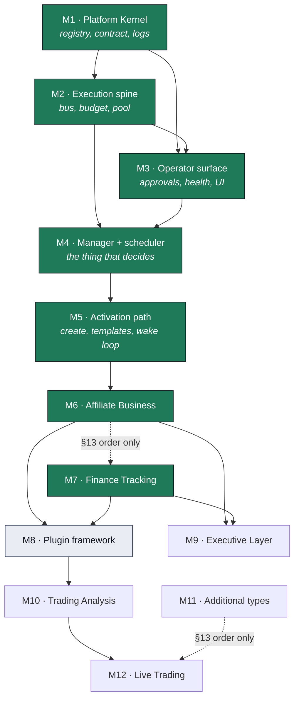

# Milestone Dependency Graph

Companion to [`ROADMAP.md`](ROADMAP.md). The roadmap says *what order*; this says *why*, edge by
edge, so a future reordering can be argued from the graph instead of from memory.

**Maintained, not decorative.** Update rules are at the bottom. The layering invariant below is
enforced by `tests/test_layering.py`, so the parts of this document that can rot are checked.

Last updated: M7 closure — both gates cleared (architecture MERGE with follow-ups, product
SHIP); M8 (Plugin framework) is next.

---

## The graph

Solid edges are real dependencies. Dashed edges are §13 ordering with no technical dependency
behind them — they are binding, but for a different reason, and that distinction is the point of
this document.

**M8 and M9 have no edge between them.** The roadmap lists the plugin framework before the
Executive Layer, but nothing requires it. Both depend only on two business types existing. They
could be swapped or run in parallel. This is recorded because a dependency that does not exist is
exactly the kind of thing that gets invented later to justify an ordering nobody remembers
choosing.

---

## Edge table

| Edge | Type | What breaks if inverted |
|---|---|---|
| M1 → M2 | Hard | The pool authorises through the Registry (D-002) and the ledger reads ceilings off the Standard Business Contract. Without M1 there is no identity to derive and no ceiling to enforce. |
| M1 → M3 | Hard | Approvals read autonomy policies from the contract; Health reads the budget cap and KPI targets. Both are §5 contract fields. |
| M2 → M3 | Hard, **narrow** | Health counts unresolved dead letters and the dashboard reads platform spend. One import path (`api → budget`). Narrow enough that M3 could have been built first against stubs — worth knowing before anyone treats this edge as immovable. |
| M2 → M4 | Hard | The Manager's whole job is dispatching capabilities. Without the pool it has nothing to do. |
| M3 → M4 | Hard | D-006's continuation model ends a cycle by raising an approval and resumes on the answer. Without the approval subsystem there is nothing to continue from, and the Manager would have to block — which D-006 exists to avoid. |
| M4 → M5 | Hard + **evidential** | The activation path starts Manager workflows and closes the D-006 wake loop; both require the Manager to exist. Produced roadmap revision 2. |
| M5 → M6 | Hard + **evidential** | A business type is prompt templates plus configuration (§4). Without template loading, business creation, and a closed wake loop, an Affiliate "business" would be a row in a table. Produced roadmap revision 3. |
| M6 ⇢ M7 | §13 order only | Finance Tracking imports nothing from Affiliate. §13 Step 3 binds the order; no technical dependency does. |
| M6, M7 → M8 | Hard | §13 Step 4 generalises "once two business types exist for real comparison". Generalising from one instance produces a framework shaped like that instance. |
| M6, M7 → M9 | Hard | §3.1 gives the Executive Layer capital allocation, portfolio balancing, and cross-business optimisation. All three are undefined with fewer than two businesses. |
| M8 → M10 | Hard | Trading Analysis is the first business type built *after* generalisation, so installing it through the plugin framework tests whether §4's "configuration only" claim survives a complex type. |
| M10 → M12 | Hard | §13 Step 7: live trading only after Trading Analysis "has run stably". A safety gate, not a build dependency. |
| M11 ⇢ M12 | §13 order only | §13 requires Live Trading be the final business type introduced. |

---

## Layering invariant

Milestones map to packages, and **a package may only import packages from its own milestone or
earlier** — with exactly three exceptions.

| Package | Milestone | | Package | Milestone |
|---|---|---|---|---|
| `kernel`, `domain`, `registry`, `observability`, `persistence`, `llm` | 1 | | `approvals`, `notifications`, `kpi`, `api` | 3 |
| `events`, `budget`, `capabilities`, `security`, `runtime` | 2 | | `manager`, `scheduler` | 4 |
| `businesses`, `shell` | 5 |
| | | | `businesses`, `shell` | 5 |
| `executive` | 9 | | | |

**Permitted exceptions — composition roots:**

- `jarvis/shell/launcher.py` — the Developer Shell (roadmap revision 3): composes the
  development topology and holds no logic (enforced by test).

- `jarvis/kernel/container.py` — the DI container constructs everything, so by definition it
  imports everything.
- `jarvis/runtime/worker.py` — the entrypoint registers the workflow, the scheduler, and (M9-1c,
  D-041) the Executive Layer's own deterministic tick.

All three are composition roots: they wire the graph rather than sit in it. Every *other* module must
import backward only. `tests/test_layering.py` asserts this, because the failure mode is gradual
— one forward import in a service module is invisible in review and the layering is gone a few
months later with no single commit to blame.

---

## Deferred completion ledger

Components built before their caller existed. Tracked explicitly because dormant code is
unverified code wearing a test suite, and because the accumulation of these is what triggered
roadmap revision 2.

| Component | Built | Caller arrived | Status |
|---|---|---|---|
| `FairQueue` (§2.2, A-004) | M2 | M4 — `CapabilityGate` | Retired |
| Approval 24h / 7d timers (§9) | M3 | M4 — `Scheduler.sweep` | Retired |
| `CredentialManager` (§10) | M2 | M6-3 — `execute_approved_action` / the publish tool (M6-F28) | Retired |
| Business Manager workflow (§2.1) | M4 | M5 — started by `ManagerLifecycle` | Retired |
| `KpiEngine.record` (§5, §11 dashboard) | M3 | M7-3b — `record_cycle_kpis` (D-027) | Retired |
| `AutonomyCounterRow.plugin_major_version` — A-003's major-version graduation reset (§8) | M3 | M8-8 — `BusinessRegistry._reset_graduation_on_major_bump` | Retired |
| `KpiEngine.health`, per-company only — no aggregation across companies (§3, COO) | M3 | M9-1a — `jarvis.executive.health.compute_portfolio_health` | Retired |
| `BudgetLedger.business_spend`/`platform_spend_24h` — enforcement only, no rollup (§3, CFO) | M2 | M9-1a — `jarvis.executive.rollup.compute_portfolio_rollup` | Retired |
| `CircuitBreaker.trip()` — writes §12.5's halt narrative; nothing in `jarvis/` calls it (§9) | M2 | M9-1b — `jarvis.executive.alerts.record_platform_halt` | Retired |
| `DecisionLog.record_platform_decision` / `platform_feed` — writer exists, no reader (§11.5) | M1 | M9-1d — `jarvis.api.app._platform_halt_reason` | Retired |
| `NotificationKind.SPENDING` — declared kind, zero writers, zero readers (§3, CFO) | M3 | M9-1b — `jarvis.executive.alerts.raise_spend_alerts` | Retired |
| `jarvis/executive/` — rollup, census, cap alerts and the halt narrative; nothing runs them on a timer yet (§3, D-041) | M9-1a…M9-1b | M9-1c — `run_executive`, composed at `runtime/worker.py` | Retired |

**The entry this ledger missed.** `KpiEngine.record` was written in M3 and had no caller for four
milestones — it was never listed here, so the debt accrued invisibly and was found by a live run
instead (M7-F21: `kpi_values` had never held a row, so every company's goal attainment was
structurally zero rather than merely unmeasured). It is the ledger's own worked example of why
the rule is "add the row when you build the component", not "add it when someone notices".

**And the entry it missed twice.** `plugin_major_version` is the same shape and was found the
same way — by reading, not by failing. The column existed from M3, A-003's rule was asserted in
four separate docstrings and in both live type modules' version comments, and it had zero readers
and zero writers for five milestones: nothing compared an installed major version to anything, and
`_reset_counter` fired on correction, denial, and operator revocation but never on a version
change. Recorded at M8-1 as **M8-F8** and retired here. Two worked examples of one rule is the
point at which the rule is the finding: a component's ledger row is written when the component is,
not when someone notices it never acquired a caller.

**M9-F1: five more, all found the same way — by reading design EXECUTIVE-LAYER.md's Part 0
census of the live platform, not by a failure.** Each is a platform primitive whose
Executive-shaped caller was never written, the identical shape to the two entries above. Two
callers land in M9-1a itself, retiring those rows immediately; the other three stay **Open**
because M9-1a builds only the deterministic CFO rollup and COO census (design Part 12 packets A
and B) — the cap-tracking alerts, the breaker's missing caller, and `platform_feed`'s first
reader are packets C and E, not built here. Recording the row when the debt is found, per this
ledger's own rule, means recording it before the caller exists too — an **Open** status is not a
gap in the bookkeeping, it is the bookkeeping.

**Two of the three retired at M9-1b**, leaving `platform_feed` deliberately Open. That row is
about the *reader*, and it still has none: M9-1b gave `record_platform_decision` its first real
writer (the halt narrative finally reaches the log), and reads the feed only to recognise its own
prior entry so one halt produces one explanation. The operator-facing reader design Part 8 names
is packet E, and the row stays Open until it lands — retiring it on the strength of a
deduplication read would be the ledger recording a caller it did not get.

**And one added, by the same rule that retired those two — then retired itself two packets later.**
M9-1a and M9-1b built the entire deterministic Executive — rollup, census, cap alerts, halt
narrative — and D-041 put its caller on a timer packet D had not yet written. Four functions that
nothing invoked was exactly the shape of the two worked examples above, and the honest moment to
write the row was the one that found it, not the one that later noticed the Executive had never
run.

**Retired at M9-1c.** `run_executive` (`jarvis/executive/runner.py`) is that caller, composed at
`runtime/worker.py` on its own asyncio timer (D-041) and, in the developer Shell, registered as a
fourth `Supervisor` part beside the worker and the scheduler (D-016/D-017) — no change to the
supervision mechanism itself, one more part added to it exactly as the scheduler already is. Every
row this milestone's Part 0 census opened is now Retired except `platform_feed`'s, which stays
Open for packet E on its own stated terms above.

**Retired at M9-1d.** `_platform_halt_reason` (`jarvis/api/app.py`) is that reader: it reads
`platform_feed`, matches the halt entry by its structured `action_type` (never a ref shown to the
operator — M9-F76), and launders `entry.rationale` through the same `render_operator_text`
boundary `activity_feed`'s own entries pass through, surfaced on `/api/summary` as
`spending_paused_reason` and rendered in the Command Center's "Spent today" tile. Every row this
milestone's Part 0 census opened is now Retired.

**Deferred at M5.** `CredentialManager` was scheduled to gain a caller here through generic tool
execution. Building it found the plan self-defeating: a tool-execution layer with no concrete tool
to run would be dormant infrastructure justifying dormant infrastructure — the exact pattern that
produced revision 2. Moved to M6, where the Affiliate Business defines tools that actually need
credentials.

A component may be built ahead of its caller when the *boundary* must be decided before anything
exists to put on the wrong side of it — which is why `CredentialManager` was written in M2. But
each entry is a debt, and a milestone that adds more than it retires deserves the scrutiny that
produced revision 2.

---

## Evidence behind revision 2

The M4 → M5 edge was not in the original roadmap. It was added after three components in a row
shipped with no caller — `CredentialManager`, `FairQueue`, and the approval timers — all of them
waiting on the same missing thing: something that wakes up and decides.

Recorded here rather than only in the roadmap because it is the graph's one worked example of a
dependency discovered by implementation rather than derived from the specification, and it is the
pattern to watch for when proposing the next adjustment.

---

## Maintenance rules

**When a milestone completes.** Move its node to the `done` class in the diagram, and update every
deferred-completion row whose caller it provided.

**When proposing a new milestone.** State its inbound edges and classify each: Hard, Evidential,
§13 ordering, or Soft. A milestone that cannot name a hard inbound edge is probably schedulable
earlier than assumed.

**When splitting or merging.** Redraw the affected edges *before* writing code, and say what the
new arrangement makes checkable that the old one did not. Revision 2's answer was that a generic
Manager makes §4's "configuration only" requirement testable; if a split has no such answer, it is
bookkeeping rather than a dependency change.

**When adding a package.** Assign it a milestone in the layering table above and in
`tests/test_layering.py`. An unassigned package is exempt from the invariant by accident.

**What must not change here.** This document records implementation sequence only. Edges derive
from the architecture; they never justify altering it. A proposed change that would move a
responsibility between layers, add or remove a layer, or weaken an invariant is an architecture
amendment under §12 and belongs in a different conversation than this one.
